## 0. Definición del proyecto
Este proyecto surge al comprobar la necesidad de un programa más eficaz, rápido e instintivo para la gestión de stock para la empresa Laiola... Situado en tal... 

Para ello se pensó en el desarrollo de una pagina web totalmente funcional  con el fin de agilizar el tiempo empleado en el pedido y recepción de los productos, a la vez que permita regularizar el stock simultáneamente, para facilitar el trabajo a los usuarios y el acceso a la página, se ha creado también un usuario y contraseña que permite conocer en todo momento en que momento y quién gestionó cada movimiento. 

La web se estructura en varias partes; Artículos, relacionada con los tipos de impuestos, familias, subfamilias de los productos y productos como tal; Ubicaciones, donde encontrarnos una sección para proveedores y almacenes con los que trabajamos.  

Procesos, en la que se desarrollan las secciones de stock, pedidos, recepciones y la regularización del stock; Usuarios, en esta sección podremos gestionar que usuarios se encuentran registrados y a que secciones tienen acceso.

Para el funcionamiento de esta web he recaudado numerosa información relacionada con el sector con el objetivo de un óptimo posicionamiento, lo que ha dado lugar a una mejora considerable del funcionamiento a la hora de gestionar el stock del almacén.
   
   

## 1.LOGIN. Accede a la app logeandote con usuario y contraseña 

 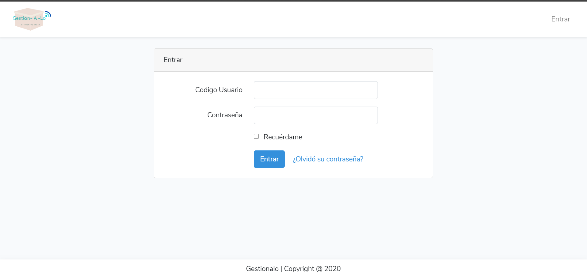

## 2.Home de la app

 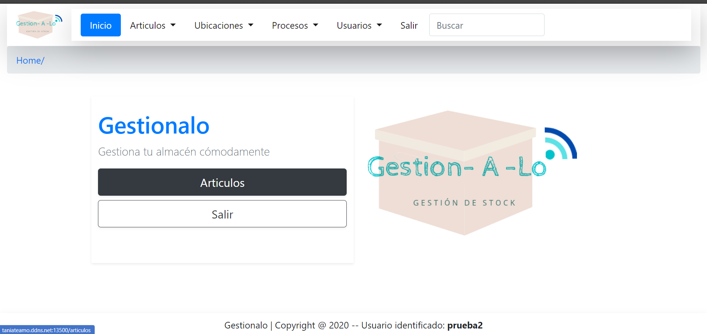

## 3. SECCION PRODUCTOS
## 3.0 Características requeridas por producto

 

## 3.1. Creamos la familia del producto: Paléts, envases, etc. Es una forma de agrupar un producto a un nivel más global

 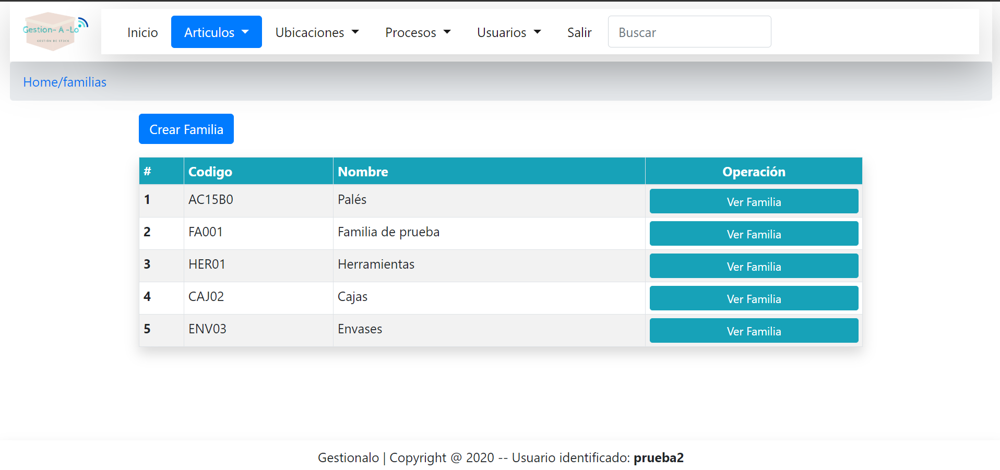

## 3.2. Creamos la subfamilia del producto: Palets de madera, palets de hierro, etc. Es una forma de subagrupar un producto a un nivel más específico.

 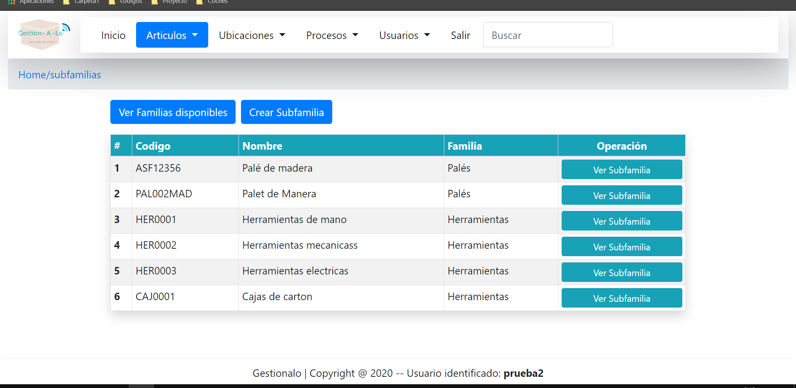

## 3.3. Creamos una marca para asignarsela al producto. Marca Scalix, Marca Smirlox, etc. Es un atributo del producto

 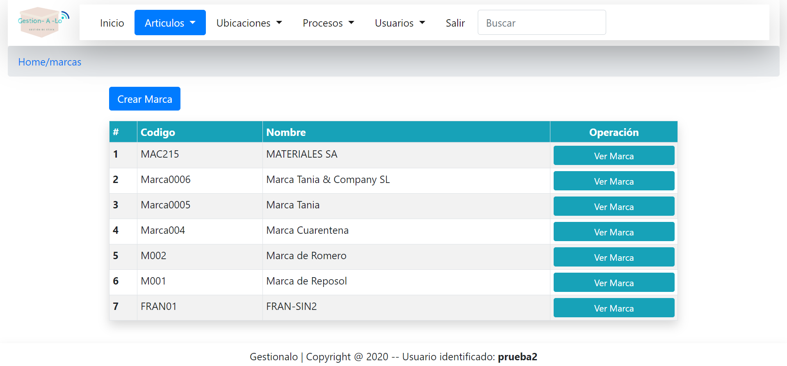

## 3.4. Creamos un impuesto para asignarselo al producto. Se entiende por impuesto como el IVA que va a tener un producto determinado. 0%, 4%, 10%, 21%... etc

 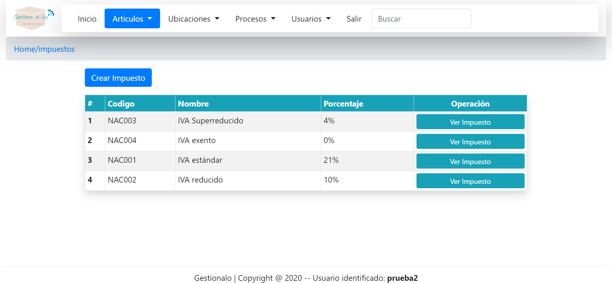

## 3.5. Finalmente creamos el producto a raíz de todas estas características. El producto debe tener un impuesto, una marca y un precio.

 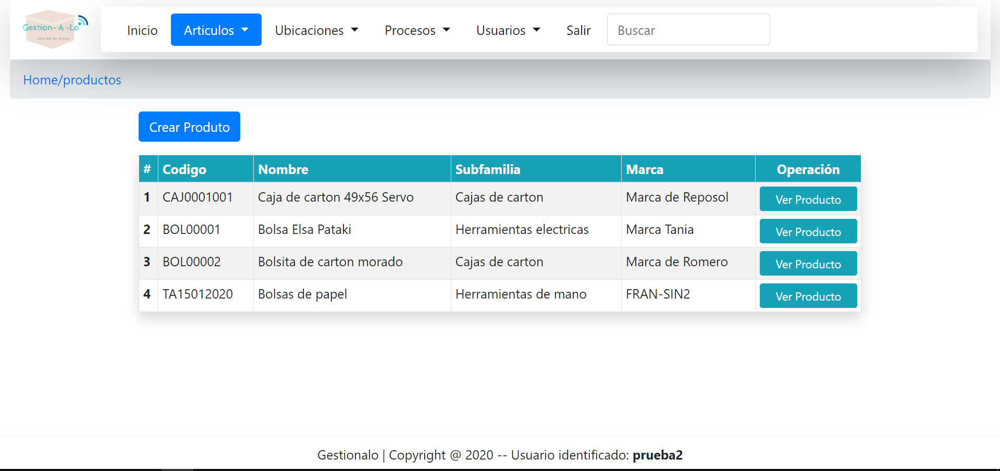

## 4. UBICACIONES
## 4.1 Almacenes. Define tu propio almacén, dirección, razón social, email, NIF, geolocalización ...

 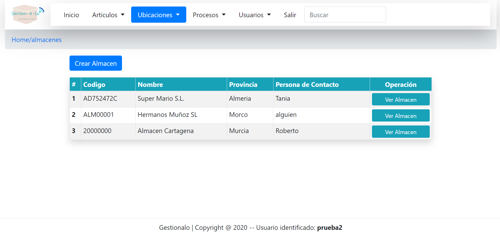

## 4.1 Proveedores. Define tu propio almacén, dirección, razón social, email, NIF ...

 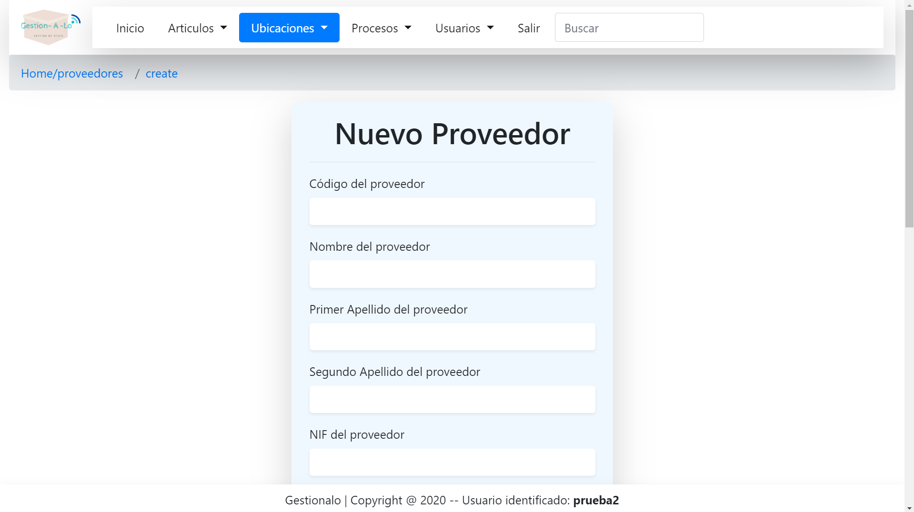

## 5. PROCESOS. Traza el recorrido desde el pedido, hasta su recepción en tu almacén. Se puede saber desde cuando se ha hecho el pedido y cuando se ha recepcionado. Se podrá saber que cantidad se ha pedido frente a la que realmente se ha recepcionado.
## 5.1.1 PEDIDOS. Historial de pedidos

 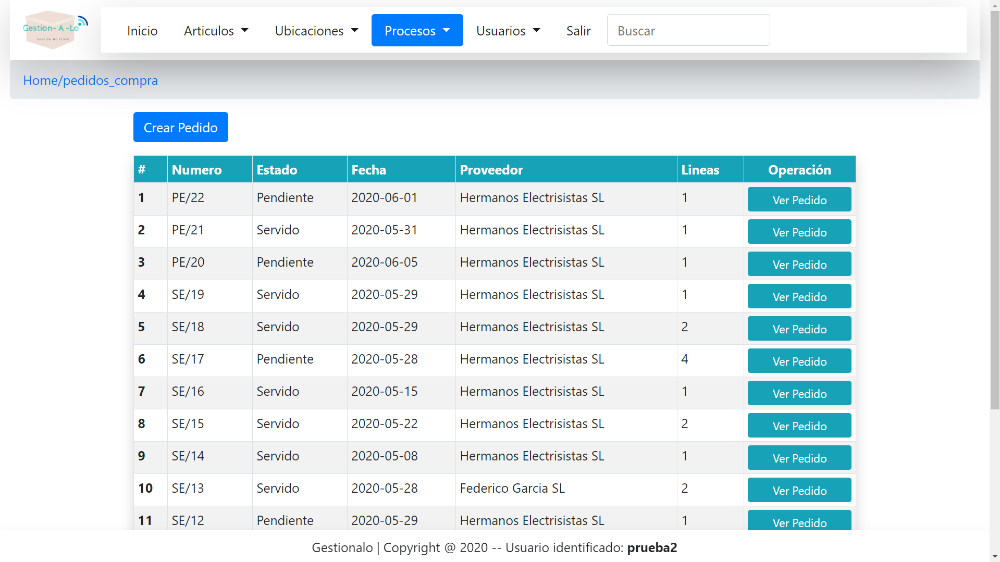

## 5.1.2 PEDIDOS. Escenario de pedidos

 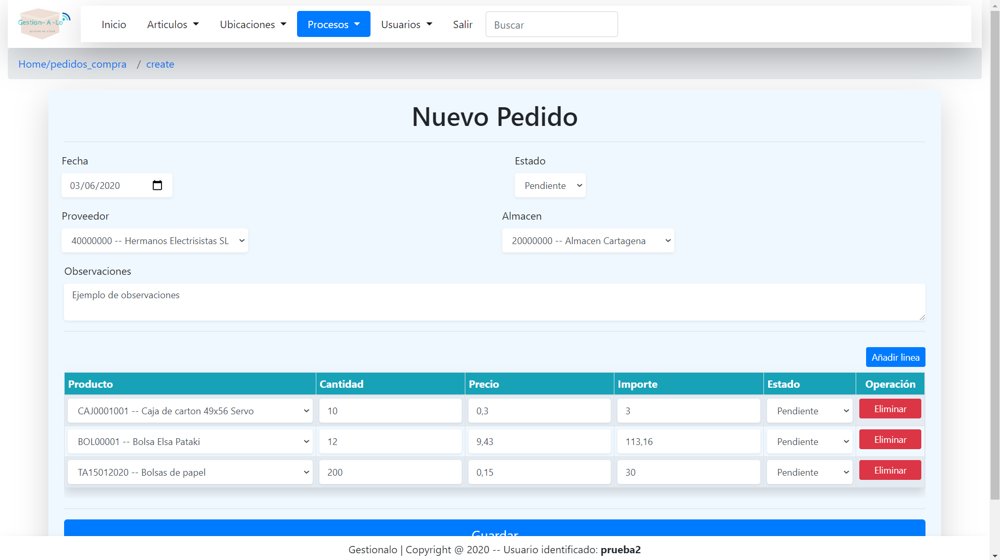

 
## 5.2.1 RECEPCIONES. Recepciona la mercancía

 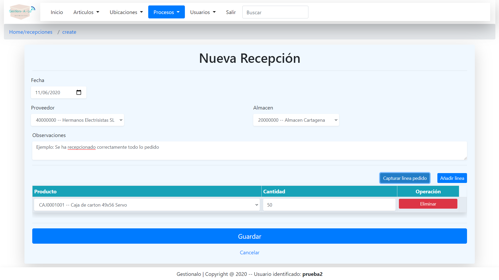

## 5.2.2 RECEPCIONES. Captura el pedido realizado previamente, sin tener que introducir nuevamente los datos. Así tendrás una trazabilidad de lo que se pide y recepciona realmente

 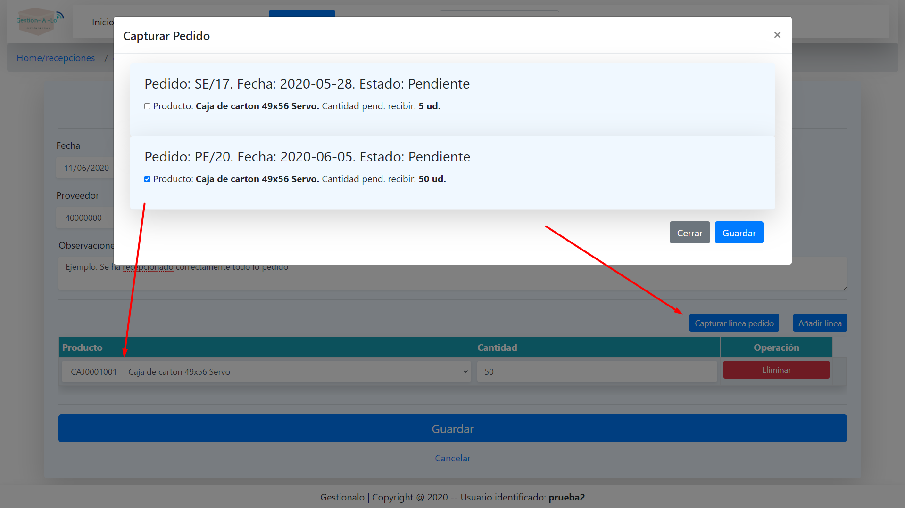

## 5.3.1 STOCK. Visualiza la cantidad que hay en stock de cada producto, en cada almacén. En tiempo real

 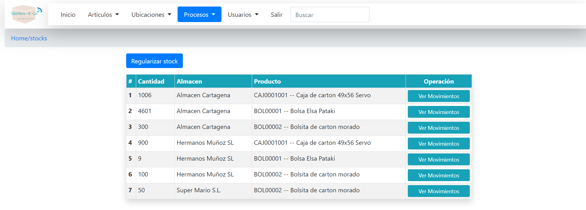

## 5.4.1 REGULARIZACIONES MANUALES. Regulariza el Stock que hay de un producto determinado en el almacén. Introduce la cantidad que hay realmente en el almacén y la app ajustará la cantidad real por medio de movimientos de entrada y salida de almacén. 

 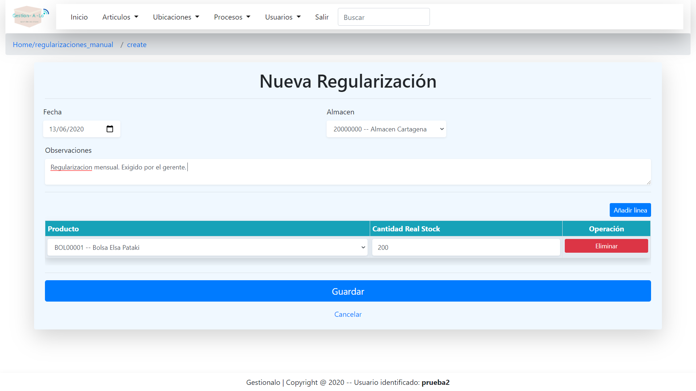

## 6. SEGURIDAD
## 6.1 USUARIOS. Crea los usuarios que tendrán acceso al sistema

 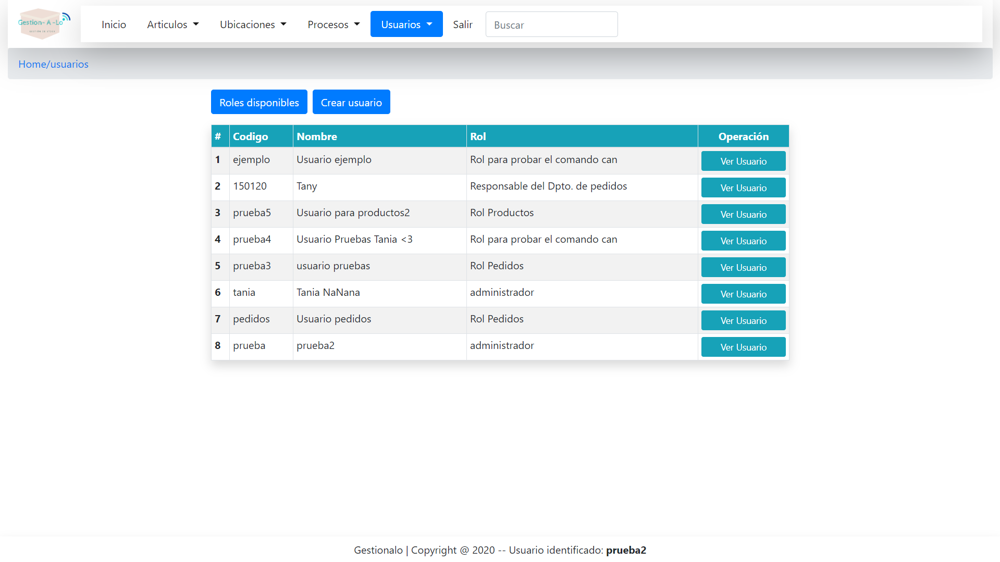

## 6.2 ROLES. Crea roles y asignaselos a los usuarios creados previamente. Decide por tí mismo qué apartado puede ver o tocar un usuario en concreto
## 6.2.1. Resumen de roles disponibles 

 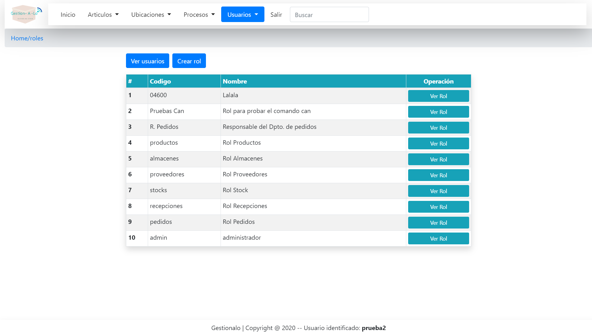

## 6.2.2. Creación de roles

 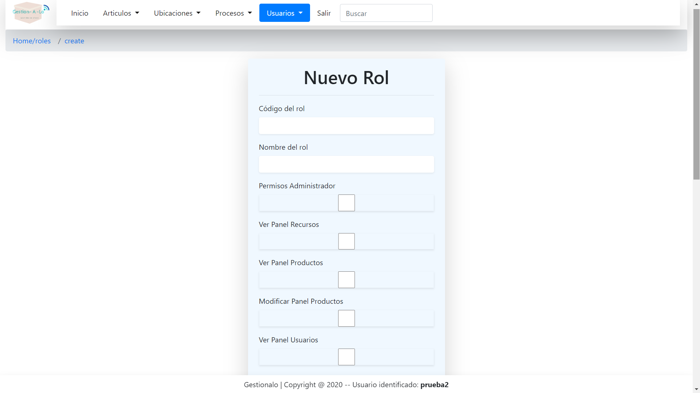

