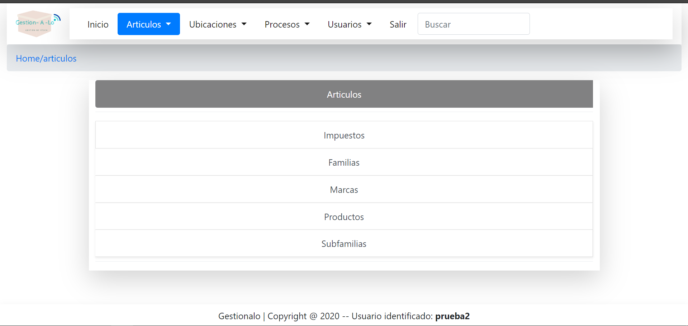

Este proyecto surge al comprobar la necesidad de un programa más eficaz, rápido e instintivo para la gestión de stock para la empresa Laiola... Situado en tal... Para ello se pensó en el desarrollo de una pagina web totalmente funcional  con el fin de agilizar el tiempo empleado en el pedido y recepción de los productos, a la vez que permita regularizar el stock simultáneamente, para facilitar el trabajo a los usuarios y el acceso a la página, se ha creado también un usuario y contraseña que permite conocer en todo momento en que momento y quién gestionó cada movimiento. La web se estructura en varias partes; Artículos, relacionada con los tipos de impuestos, familias, subfamilias de los productos y productos como tal; Ubicaciones, donde encontrarnos una sección para proveedores y almacenes con los que trabajamos;  Procesos, en la que se desarrollan las secciones de stock, pedidos, recepciones y la regularización del stock; Usuarios, en esta sección podremos gestionar que usuarios se encuentran registrados y a que secciones tienen acceso .
Para el funcionamiento de esta web he recaudado numerosa información relacionada con el sector con el objetivo de un óptimo posicionamiento, lo que ha dado lugar a una mejora considerable del funcionamiento a la hora de gestionar el stock del almacén.

## 1.LOGIN. Accede a la app logeandote con usuario y contraseña 

 

## 2.Home de la app

 

## 3. SECCION PRODUCTOS
## 3.0 Podemos ver de manera global todas las características que se le pueden asignar a un producto determinado

 

## 3.1. Creamos la familia del producto: Paléts, envases, etc. Es una forma de agrupar un producto a un nivel más global

 

## 3.2. Creamos la subfamilia del producto: Palets de madera, palets de hierro, etc. Es una forma de subagrupar un producto a un nivel más específico.

 

## 3.3. Creamos una marca para asignarsela al producto. Marca Scalix, Marca Smirlox, etc. Es un atributo del producto

 

## 3.4. Creamos un impuesto para asignarselo al producto. Se entiende por impuesto como el IVA que va a tener un producto determinado. 0%, 4%, 10%, 21%... etc

 

## 3.5. Finalmente creamos el producto a raíz de todas estas características. El producto debe tener un impuesto, una marca y un precio.

 

